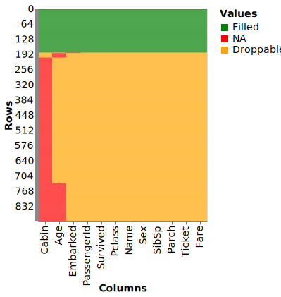

# scikit-na

`scikit-na` is a Python package for missing data (NA) analysis. It includes useful routines for descriptive and inferential statistics. Data visualization is done using two backends—[matplotlib](https://matplotlib.org/) and [Altair](https://altair-viz.github.io/).

## Features

* Interactive report (with [ipywidgets](ipywidgets.readthedocs.io/))
* Descriptive statistics
* Regression modelling
* Hypotheses tests
* Rich visualization: heatmaps, scatterplots, histograms

## Installation

Package can be installed from PyPi:

```bash
pip install scikit-na
```

or from this repo:

```bash
pip install git+https://github.com/maximtrp/scikit-na.git
```

## Example

We will use Titanic dataset (from Kaggle) that contains NA values in three columns: Age, Cabin, and Embarked.

```python
import scikit_na as na
import pandas as pd

data = pd.read_csv('titanic_dataset.csv')
na.describe(data)
```

|                             |   PassengerId |   Survived |   Pclass |   Name |   Sex |    Age |   SibSp |   Parch |   Ticket |   Fare |   Cabin |   Embarked |
|:----------------------------|--------------:|-----------:|---------:|-------:|------:|-------:|--------:|--------:|---------:|-------:|--------:|-----------:|
| NA count                    |             0 |          0 |        0 |      0 |     0 | 177    |       0 |       0 |        0 |      0 |  687    |       2    |
| NA, % (per column)          |             0 |          0 |        0 |      0 |     0 |  19.87 |       0 |       0 |        0 |      0 |   77.1  |       0.22 |
| NA, % (of all NAs)          |             0 |          0 |        0 |      0 |     0 |  20.44 |       0 |       0 |        0 |      0 |   79.33 |       0.23 |
| NA unique (per column)      |             0 |          0 |        0 |      0 |     0 |  19    |       0 |       0 |        0 |      0 |  529    |       2    |
| NA unique, % (per column)   |             0 |          0 |        0 |      0 |     0 |  10.73 |       0 |       0 |        0 |      0 |   77    |     100    |
| Rows left after dropna()    |           891 |        891 |      891 |    891 |   891 | 714    |     891 |     891 |      891 |    891 |  204    |     889    |
| Rows left after dropna(), % |           100 |        100 |      100 |    100 |   100 |  80.13 |     100 |     100 |      100 |    100 |   22.9  |      99.78 |

*NA unique* is the number of NA values per each column that are unique for it, i.e. do not intersect with NA values in the other columns (or that will remain in dataset if we drop NA values in the other columns).

We can also calculate descriptive statistics for the whole dataset:

```python
na.describe(data, per_column=False)
```

|                                |   dataset |
|:-------------------------------|----------:|
| Total columns                  |      12   |
| Total rows                     |     891   |
| Rows with NA                   |     708   |
| Rows without NA                |     183   |
| Total cells                    |   10692   |
| Cells with NA                  |     866   |
| Cells with NA, %               |       8.1 |
| Cells with non-missing data    |    9826   |
| Cells with non-missing data, % |      91.9 |

### Visualization

#### Heatmap

Now, let's visualize NA values with a heatmap (and its nice implementation in Altair/Vega):



Droppables are those values that will be dropped if we simply use `data.dropna()` for the *whole dataset*.

#### Stairs plot

Stairs plot is one more useful visualization of dataset shrinkage after applying `pandas.DataFrame.dropna()` method to each column cumulatively:


After dropping all NAs in `Cabin` column, we are left with 21 more NAs (in `Age` and `Embarked` columns). This visualization also shows tooltips with exact numbers of NA values that are dropped per each column.