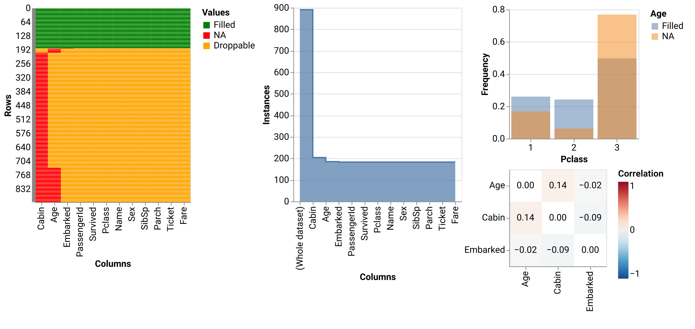

scikit-na
=========

**scikit-na** is a comprehensive Python toolkit for missing data analysis and visualization.
It provides statistical functions, interactive dashboards, and publication-ready visualizations
to help researchers understand and handle missing data patterns effectively.

Key Features
~~~~~~~~~~~~

* **Interactive Dashboard**: Explore missing data patterns with Jupyter widgets
* **Statistical Analysis**: Comprehensive summary statistics and correlation analysis
* **Missing Data Mechanisms**: Test for MCAR, MAR, and MNAR patterns
* **Predictive Modeling**: Logistic regression for missingness patterns
* **Rich Visualizations**: Publication-ready plots with matplotlib and Altair
* **Export Capabilities**: Save results in multiple formats (CSV, JSON, HTML, Excel)

Quick Example
~~~~~~~~~~~~~

.. code-block:: python

   import pandas as pd
   import scikit_na as na

   # Load your data
   data = pd.read_csv('your_data.csv')

   # Get comprehensive summary
   summary = na.summary(data)

   # Create interactive dashboard
   dashboard = na.report(data)

   # Visualize missing patterns
   na.altair.plot_heatmap(data)

Why scikit-na?
~~~~~~~~~~~~~~

Missing data is a common challenge in data analysis that can lead to biased results
and reduced statistical power. **scikit-na** provides a systematic approach to:

* **Understand** the extent and patterns of missingness
* **Visualize** missing data relationships and dependencies
* **Test** assumptions about missing data mechanisms
* **Document** your missing data analysis with reproducible reports

.. toctree::
   :maxdepth: 2
   :caption: Usage
   :hidden:

   Installation <install>
   Interactive report <report>
   Statistics <stats>
   Regression modeling <regression>
   Data visualization <vis>

.. toctree::
   :maxdepth: 2
   :caption: API
   :hidden:

   scikit_na <scikit_na>
   scikit_na.altair <scikit_na.altair>
   scikit_na.mpl <scikit_na.mpl>
