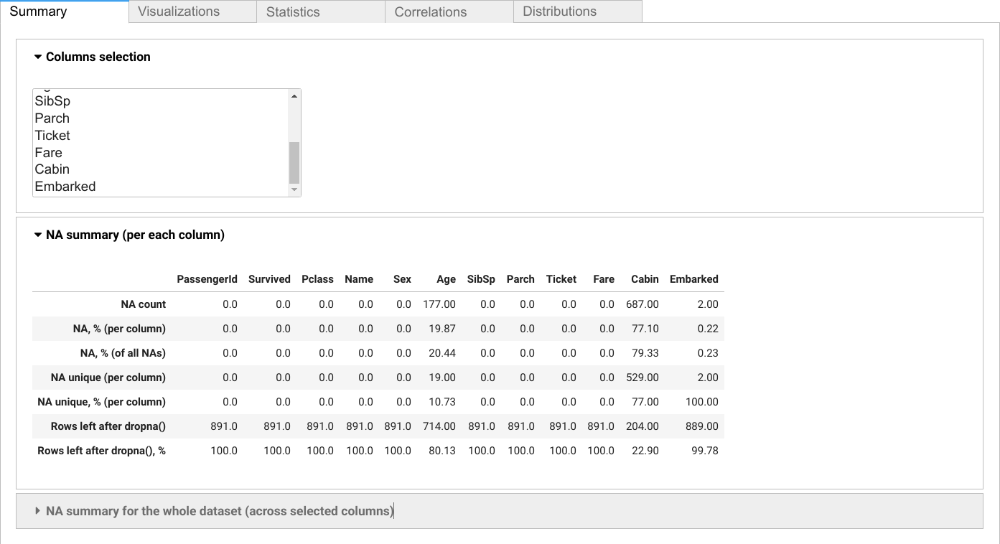
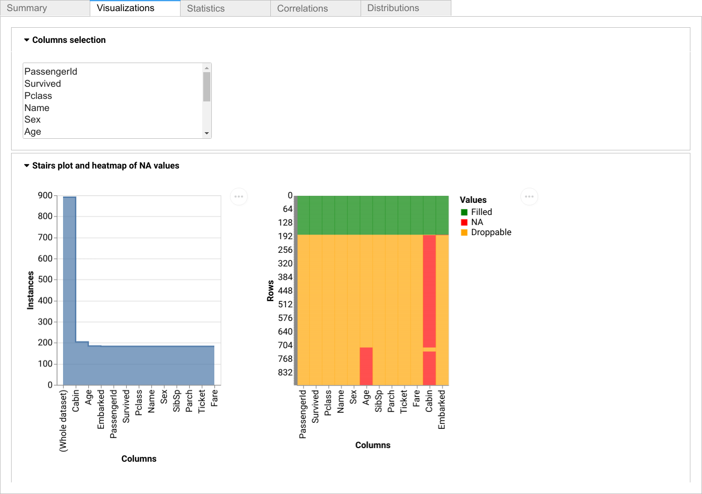
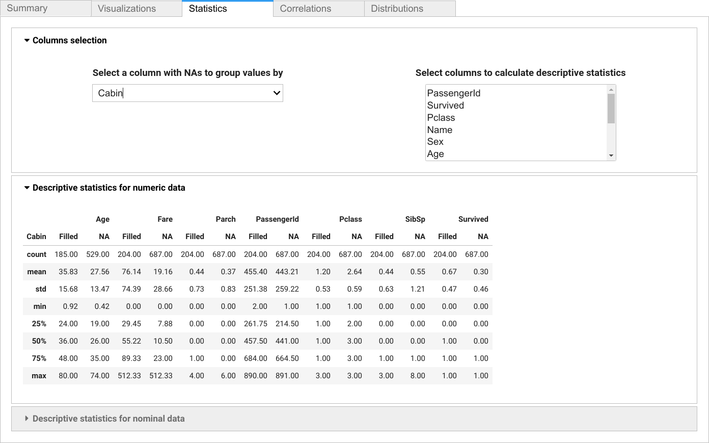
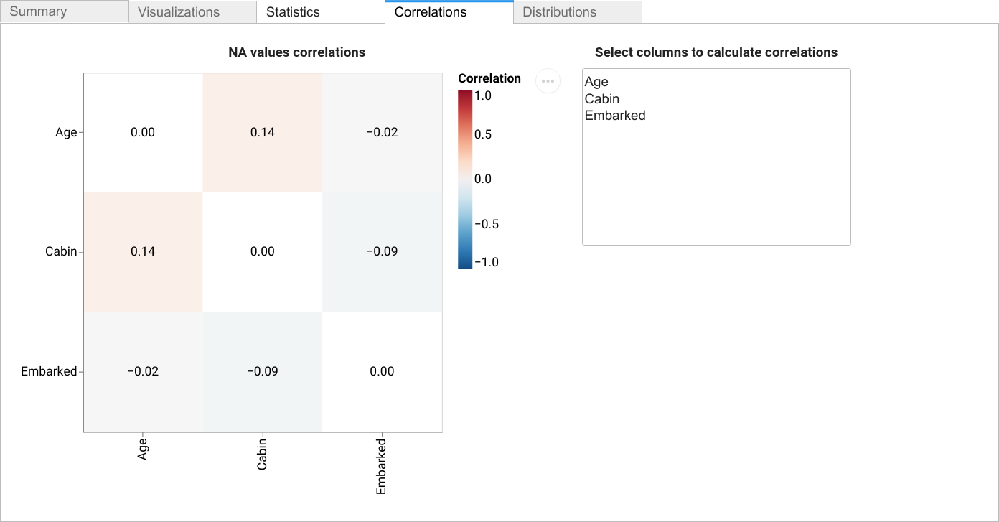
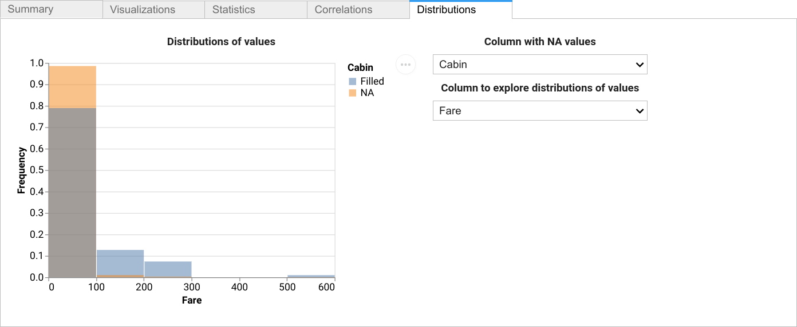

Interactive Dashboard
=====================

The **scikit-na** interactive dashboard provides a comprehensive, user-friendly interface
for exploring missing data patterns. Built with `ipywidgets <https://github.com/jupyter-widgets/ipywidgets>`_,
it offers real-time analysis through multiple coordinated views.

Quick Start
~~~~~~~~~~~

Create an interactive dashboard in just a few lines:

.. code-block:: python

   import pandas as pd
   import scikit_na as na

   # Load your data
   data = pd.read_csv('titanic_dataset.csv')

   # Launch interactive dashboard
   dashboard = na.report(data)
   display(dashboard)

Features Overview
~~~~~~~~~~~~~~~~~

The dashboard includes five integrated analysis tabs:

1. **Summary**: Column-selectable statistics with real-time updates
2. **Visualizations**: Interactive heatmaps and impact analysis
3. **Statistics**: Comparative analysis grouped by missingness
4. **Correlations**: Missing value pattern relationships
5. **Distributions**: Value distribution comparisons

Dashboard Tabs
~~~~~~~~~~~~~~

Summary tab
~~~~~~~~~~~

Visualization tab
~~~~~~~~~~~~~~~~~

Statistics tab
~~~~~~~~~~~~~~

Correlations tab
~~~~~~~~~~~~~~~~

Distributions tab
~~~~~~~~~~~~~~~~~

